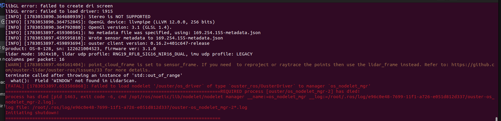
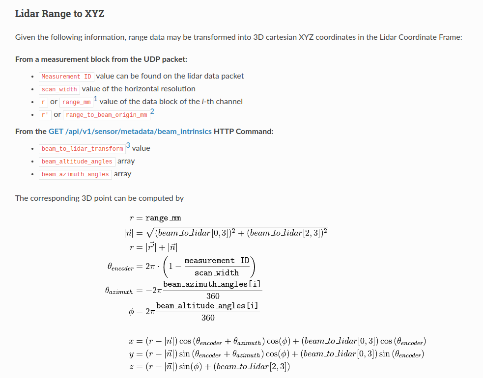

[ouster sdk](https://github.com/ouster-lidar/ouster-sdk)

- PCB wrong silkscreen
  - ethernet connection 
   - Br -> Bl/
   - Br/ -> G/
   - G -? Br/
   - Bl/ -> Br
   - O/ -? Bl
   - O -> G/
   - G/ -> O
   - Bl -> O/ ,,
  - wire clamping

  for showing lidar view
  $ ouster-cli source 169.254.155.51 viz

  the error from rizv
  
  roslaunch ouster_ros driver.launch sensor_hostname:=169.254.155.51

way to calculate position
