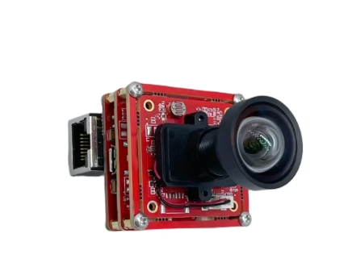
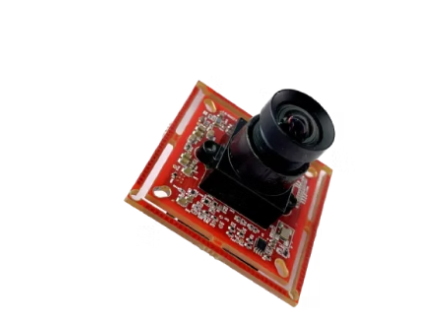
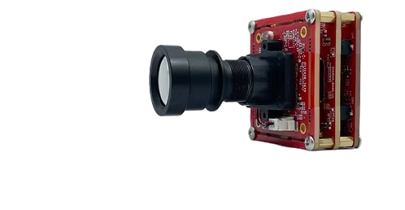
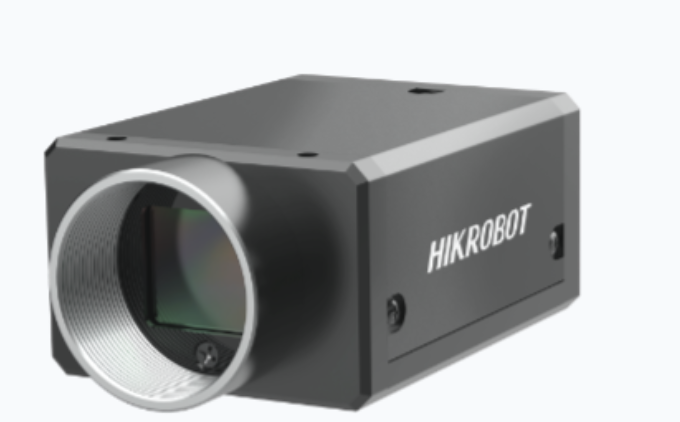
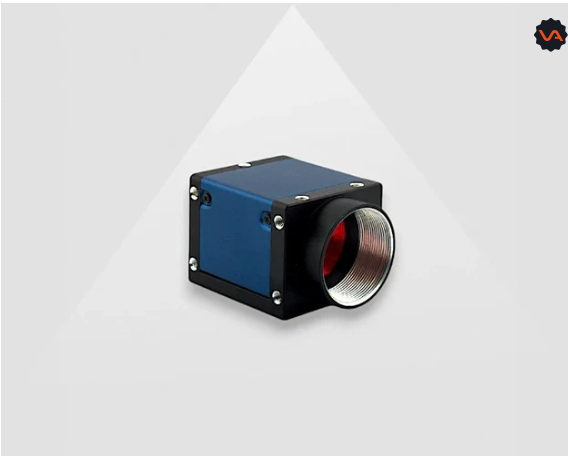
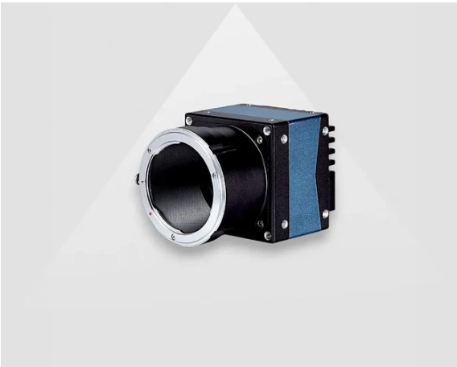
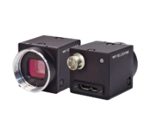
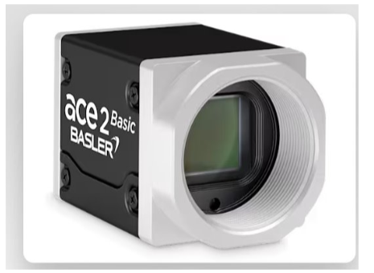
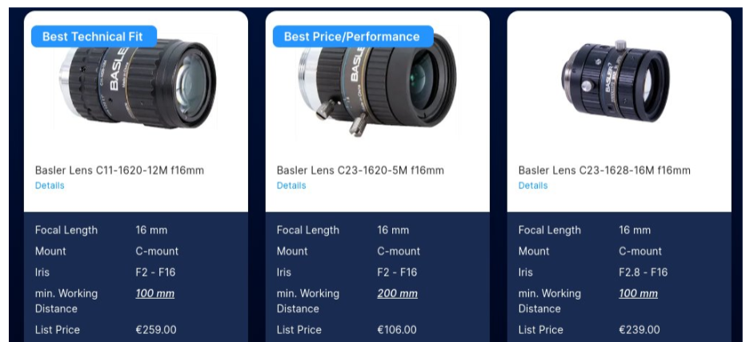
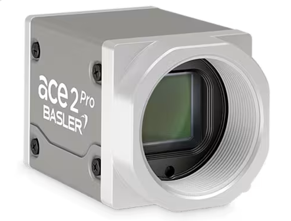

# camera for tram

## camera choice

### [AR0234 Global Shutter 1080P GigE Camera](https://www.vadzoimaging.com/product/ar0234-global-shutter-1080p-gige-camera?srsltid=AfmBOoqtDmnHmppIHCp8XwK698ebaL9jrA2cxYQCif6fcI1ZtfKbz-Wc)

| Feature | Specification |
|---------|---------------|
| Resolution | 2.3 Megapixels (1920 × 1200) |
| Shutter Speed | Global Shutter (10μs up to 33ms) |
| FPS | 60 fps at 1920×1200 / 1080p, 120 fps at 720p / VGA |
| Field of View (FOV) | 80° to 105° (Diagonal), or around 85° Horizontal & 69° Vertical. |
| Zoom In/Out Capability | no |
| Power supply | PoE |
| Distance Coverage | Typically 2 meters to infinity by default, depending heavily on the focal length of the attached M12 lens. |
| Price | 3589.1 HKD |
| Interface | GigE (Gigabit Ethernet)  |
| Dimension | 38mm x 38mm|
| Weight | 25g|
| Network Interface | Gigabit Ethernet (RJ45), PoE (802.3af), GPIO header |
| Video Streaming Protocol | GigE Vision, ONVIF Profile S/T/G/M, H.264/H.265/MJPEG, RTSP |
| Control Interface | VISPA NXT SDK (C/C++/Python), GenICam, HW/SW trigger via GPIO, desktop app (Win/Linux) |
| Band Width | 1 Gbps (1000Base-T) |
| Lens Mount | M12 S-Mount (interchangeable) |

### [AR0234 Color Global Shutter MIPI Camera](https://www.vadzoimaging.com/product/ar0234-2mp-color-global-shutter-mipi-camera?srsltid=AfmBOoqJxWZM8UrywqH7Zfm1uGoDNIlCeke9fPxywQmzDPNTgN9LXUqH)

| Feature | Specification |
|---------|---------------|
| Resolution | 2.3 Megapixels (1920 × 1200) |
| Shutter Speed | Global Shutter (10μs to 3000ms) |
| FPS | 60 fps at 1920×1200 (2-lane MIPI with ISP), up to 120 fps at lower resolutions |
| Field of View (FOV) | 3.6mm M12 lens: 90° Horizontal, 75° Vertical, 120° Diagonal |
| Zoom In/Out Capability | no|
| Power supply | DC power|
| Distance Coverage | Focus range from 20cm to infinity |
| Price | 1541.51 HKD|
| Interface | 2 Lane MIPI CSI-2 & 4 Lane MIPI CSI-2|
| Dimension | 38mm x 38mm|
| Weight | 25g|
| Network Interface | MIPI CSI-2 (15-pin FFC ribbon, direct to SoC) — no Ethernet/Wi-Fi, requires host board |
| Video Streaming Protocol | RAW Bayer via V4L2; GStreamer → UDP/RTSP via host (no onboard streaming) |
| Control Interface | I²C, V4L2 ioctl, C++/Python SDK, HW trigger pin |
| Band Width | 2-lane MIPI: 1.8 Gbps; 4-lane MIPI: 3.6 Gbps |
| Lens Mount | M12 S-Mount (interchangeable) |

### [AR0234 Global Shutter 1080P WIFI Camera](https://www.vadzoimaging.com/product-page/onsemi-ar0234-1080p-wifi-camera?srsltid=AfmBOorY0q0nVY6GYmfMBtDscHsTQpAvDTLyEDIczAo749kD0ZePHTAv)

| Feature | Specification |
|---------|---------------|
| Resolution | 2.3 Megapixels (Active Array: 1920 × 1200 or 1080P mode) |
| Shutter Speed | Global Shutter (Eliminates high-speed rolling artifacts/jello effect) |
| FPS | 30 fps at 1080p (WiFi bandwidth constrained), up to 60 fps at 720p |
| Field of View (FOV) | 105° Diagonal (DFOV) |
| Zoom In/Out Capability | No |
| Power supply | PoE |
| Distance Coverage | Focus range from 20cm to infinity |
| Price | 4567.85 HKD|
| Interface | Wi-Fi 802.11ac / Gigabit Ethernet (PoE) |
| Dimension | 38mm x 38mm|
| Weight | 25g|
| Network Interface | Dual-Band Wi-Fi 802.11ac (2.4/5 GHz) + RJ45 PoE (802.3af), BT 5.0 |
| Video Streaming Protocol | RTSP, ONVIF Profile S/T, H.264/H.265/MJPEG |
| Control Interface | Vadzo360 desktop app (Win/Linux), ONVIF, libcamera, HW trigger via GPIO |
| Band Width | Wi-Fi up to 433 Mbps; GigE PoE 1 Gbps |
| Lens Mount | M12 S-Mount (interchangeable) |

### [MV-CH100-60UC](https://jiajing.waterball-design.com/products/page/1309)

- Hikrobot 1/1.8”, 12mm, f2.4, 10MP, C-Mount Lens
    - Φ 29 × 37 mm

| Feature | Specification |
|---------|---------------|
| Resolution | 10 Megapixels (4096 × 2460) |
| Shutter Speed | Global Shutter ( 80μs to 10 seconds ) |
| FPS | 36 fps at 4096×2460 |
| Field of View (FOV) | Lens Dependent |
| Zoom In/Out Capability | No |
| Power supply | PoE |
| Distance Coverage | Adjustable to infinity |
| Price | ~3000 HKD |
| Interface | USB3.0, [機器視覺全能型智能相機客戶端SCVM (Machine Vision All-in-One Smart Camera Client SCVM)](https://jiajing.waterball-design.com/download/6)|
| Dimension | 29 mm × 44 mm × 59 mm|
| Weight | 113 g|
| Network Interface | USB 3.0 Micro-B (no Ethernet, no Wi-Fi) |
| Video Streaming Protocol | USB3 Vision (no RTSP — host-side streaming only via SDK) |
| Control Interface | MVS desktop app, GenICam, HW/SW trigger via 6-pin P7 GPIO |
| Band Width | USB 3.0 (5 Gbps) |
| Lens Mount | C-Mount |

### [Daheng Imaging ME2P-1230-23U3M](https://va-imaging.com/products/usb3-camera-industrial-12-3mp-monochrome-sony-imx304-me2p-1230-23u3m) 

- VA-LCM-20MP-50MM-F2.8-110 Lens C-mount
    - \(\Phi \) 50.5 \(\times \) 53.9 mm

| Feature | Specification |
|---------|---------------|
| Resolution | 12 Megapixels (4096 × 3000) |
| Shutter Speed | Global Shutter ( 28µs to 1s ) |
| FPS | 23.5 fps at 4096×3000 |
| Field of View (FOV) | lens dependance |
| Zoom In/Out Capability | No |
| Power supply | USB |
| Distance Coverage | lens dependance  |
| Price |  €1.127,00  |
| Interface | USB3 Vision [Galaxy_Linux-x86_Gige-U3_32bits-64bits_2.4.2507.9231 SDK](https://va-imaging.com/pages/customerdownloads?submissionGuid=6c9b9c41-14db-4626-913f-3487c0c42219)|
| Dimension | 36mm × 31mm × 38.8mm|
| Weight | 66g|
| Network Interface | USB 3.0 Micro-B (locking screws), no Ethernet |
| Video Streaming Protocol | USB3 Vision (no RTSP — host-side streaming only via SDK) |
| Control Interface | Daheng SDK (C++/Python, Win/Linux/ARM), GenICam, HW/SW trigger via GPIO |
| Band Width | USB 3.0 (5 Gbps) |
| Lens Mount | C-Mount / CS-Mount |

### [Daheng Imaging MARS-3140-3GM/C-P](https://va-imaging.com/products/gige-vision-camera-31-4mp-poe-monochrome-sony-imx342-mars-3140-3gm-p?srsltid=AfmBOoqoLHMmpX54zeuXRSECAr05_gqvLCbyK0cv1tet_gAtnGjX5UDH)

#### F mount
- AF-S DX MICRO NIKKOR 85MM F/3.5G ED VR
    - \(\Phi \) 73.0 \(\times \) 98.5 mm

| Feature | Specification |
|---------|---------------|
| Resolution | 	31.4 Megapixels (6464 × 4852) |
| Shutter Speed | Global Shutter ( 63 µs ~ 1 s ) |
| FPS | 3.4 fps at 6464×4852 |
| Field of View (FOV) | lens dependance |
| Zoom In/Out Capability | No |
| Power supply | PoE |
| Distance Coverage | lens dependance |
| Price |  ￥40,800 CNY|
| Interface | GigE (Gigabit Ethernet) with [Galaxy_Linux-x86_Gige-U3_32bits-64bits_2.4.2507.9231 SDK](https://va-imaging.com/pages/customerdownloads?submissionGuid=6c9b9c41-14db-4626-913f-3487c0c42219)  |
| Dimension | 52.1mm × 62mm × 62mm|
| Weight | 292g|
| Network Interface | Gigabit Ethernet (RJ45, locking screws), PoE (802.3af), 12-pin Hirose GPIO |
| Video Streaming Protocol | GigE Vision (no RTSP — industrial protocol via SDK) |
| Control Interface | Daheng SDK (C++/Python, Win/Linux/ARM/Mac), GenICam, HW/SW trigger via 12-pin Hirose GPIO |
| Band Width | 1 Gbps (1000Base-T) |
| Lens Mount | F-Mount (default) or M42-Mount |

### [Teledyne FLIR Blackfly S USB3 (BFS-U3-88S6M-C)](https://www.digikey.hk/zh/products/detail/flir-integrated-imaging-solutions-inc/bfs-u3-88s6m-c/16528280?_gl=1*ppbfcc*_up*MQ..*_gs*MQ..&gclid=Cj0KCQjwjb3SBhDgARIsAMKiWzilR7kih3oCrjCjyZGTSADuoGe4DB_lVC1OKCn2H1kEWKp0aODIAb8aAlbiEALw_wcB&gclsrc=aw.ds&gbraid=0AAAAADrbLlgwvF1DmDCYWvj15ApyOBNve)

#### lens
- Teledyne FLIR Lenses
    - 8mm: \(\Phi \) 70.4 \(\times \) 90.5 mm
    - 12mm: \(\Phi \) 70.4 \(\times \) 90.5 mm
    - 16mm: \(\Phi \) 48.0 \(\times \) 58.0 – 60.4 mm
    - 25mm: \(\Phi \) 37.5 \(\times \) 45.3 mm
    - 35mm: \(\Phi \) 48.1 \(\times \) 65.8 mm
    - 50mm: \(\Phi \) 50.0 \(\times \) 76.6 mm

| Feature | Specification |
|---------|---------------|
| Resolution | 8.9 Megapixels (4096 × 2160) |
| Shutter Speed | Global Shutter ( 10 µs to 30 seconds ) |
| FPS | 32 fps at 4096×2160 (Mono8), 26 fps (Mono12p), 16 fps (Mono16) |
| Field of View (FOV) | Lens dependance |
| Zoom In/Out Capability | No |
| Power supply | USB   |
| Distance Coverage |  Lens dependance  |
| Price |  ~4,800 HKD |
| Interface | USB 3.1 |
| Dimension | 29 mm × 29 mm × 30|
| Weight | 36g|
| Network Interface | USB 3.1 Gen 1 Micro-B (locking screws), [Spinnaker SDK](https://www.teledynevisionsolutions.com/en-gb/products/spinnaker-sdk/?model=Spinnaker%20SDK&vertical=machine%20vision&segment=iis) |
| Video Streaming Protocol | USB3 Vision (no RTSP — host-side streaming only via SDK) |
| Control Interface | Spinnaker SDK (C/C++/C#/VB.NET), SpinView desktop app, GenICam, HW/SW trigger via 6-pin Hirose GPIO |
| Band Width | USB 3.1 Gen 1 (5 Gbps) |
| Lens Mount | C-Mount |

### [Basler ace 2 R Basic  (a2A4096-30umBAS)](https://www.baslerweb.com/en/shop/a2a4096-30umbas/)

| Feature | Specification | 
|---------|---------------|
| Resolution | 12.3 Megapixels (4096 × 3000) |
| Shutter Speed | Global Shutter ( 14µs to 10 seconds ) |
| FPS | 29.3 fps at 4096×3000 (default), up to 31.7 fps (throughput limit off) |
| Field of View (FOV) | Lens dependance  |
| Zoom In/Out Capability | No |
| Power supply |  PoE on GigE interface, USB in USB interface , 2 DC supply on 5GigE interface|
| Distance Coverage | Lens dependance  |
| Price | €1,139.00 |
| Interface | USB 3.0 or GigE or 5GigE|
| Network Interface | USB 3.0 Micro-B [Pylon SDK](https://www.baslerweb.com/en/shop/a2a4096-30umbas/) or GigE RJ45 or 5GigE RJ45 (model dependent) |
| Video Streaming Protocol | USB3 Vision / GigE Vision (no RTSP — industrial protocol), Compression Beyond |
| Control Interface | pylon SDK (C++/C#/Python), pylon Viewer desktop app, GenICam, HW/SW trigger via M8 6-pin GPIO |
| Band Width | USB 3.0: 5 Gbps, GigE: 1 Gbps, 5GigE: 5 Gbps |
| Lens Mount | C-Mount |
#### [lens for basler ace 2](https://www.baslerweb.com/en/tools/lens-selector/#option-camera;model=a2A4096-30umBAS;focallength=16.1;workingdistance=20)

### [Basler ace 2 R Pro(a2A4096-30umBAS)](https://www.baslerweb.com/en/shop/a2a4096-30umbas/)
- use this SDK 

| Feature | Specification |
|---------|---------------|
| Resolution | 12.3 Megapixels (4096 × 3000) |
| Shutter Speed | Global Shutter ( 14µs to 10 seconds ) |
| FPS | 29.3 fps at 4096×3000 (default), up to 31.7 fps (throughput limit off) |
| Field of View (FOV) | Lens dependance  |
| Zoom In/Out Capability | No |
| Power supply | PoE on GigE interface, USB in USB interface |
| Distance Coverage | Lens dependance  |
| Price | €1,339.00 |
| Interface | USB 3.0 or GigE|
| Dimension | 42.8 mm × 29 mm × 29 mm|
| Weight | 85g|
| Network Interface | USB 3.0 Micro-B or GigE RJ45 (model dependent) [Pylon SDK](https://www.baslerweb.com/en/shop/a2a4096-30umbas/)|
| Video Streaming Protocol | USB3 Vision / GigE Vision (no RTSP — industrial protocol), Compression Beyond |
| Control Interface | pylon SDK (C++/C#/Python), pylon Viewer desktop app, GenICam, HW/SW trigger |
| Band Width | USB 3.0: 5 Gbps, GigE: 1 Gbps |
| Lens Mount | C-Mount |

#### [lens for basler ace 2](https://www.baslerweb.com/en/tools/lens-selector/#option-camera;model=a2A4096-30umBAS;focallength=16.1;workingdistance=20)

- Basler Lens
    - C11-1620-12M f16mm: \(\Phi \) 40.5 \(\times \) 61.5 mm
    - C23-1620-5M f16mm: \(\Phi \) 29.0 \(\times \) 38.3 mm
    - C23-1628-16M f16mm: \(\Phi \) 31.8 \(\times \) 39.5 – 41.5 mm

