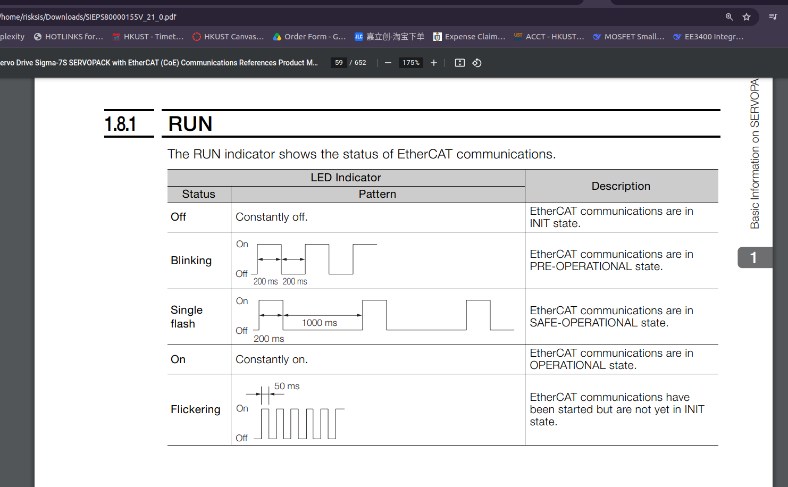
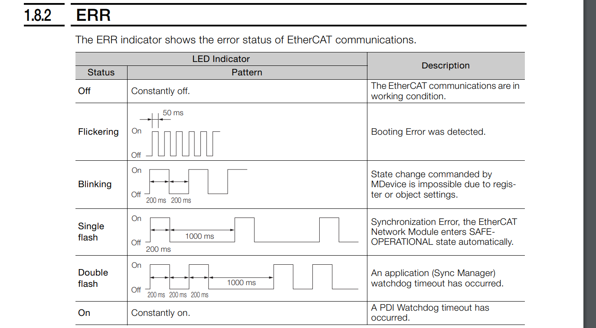
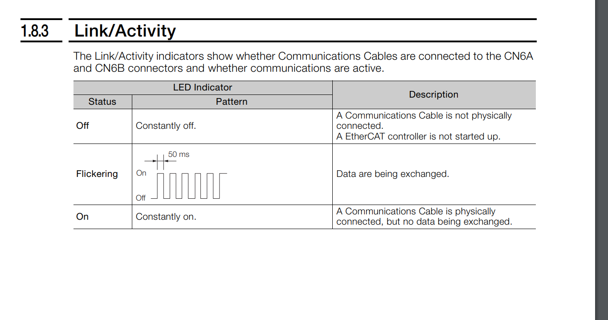
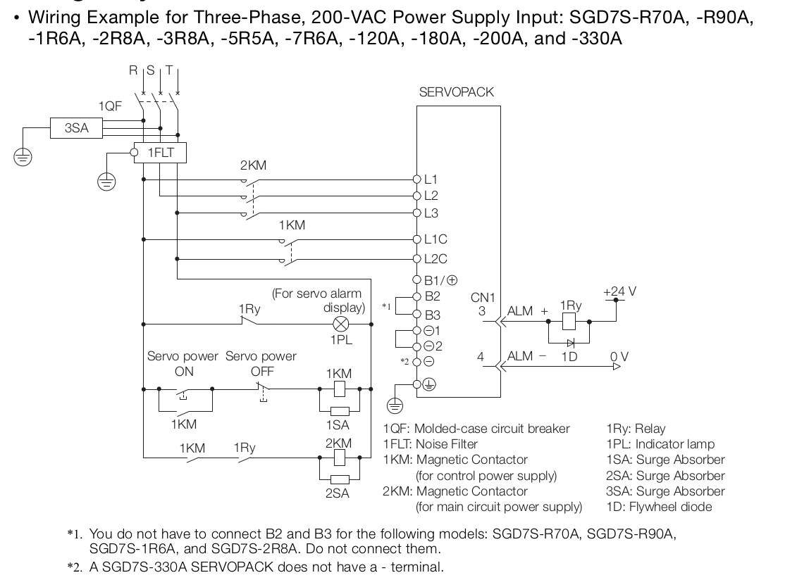
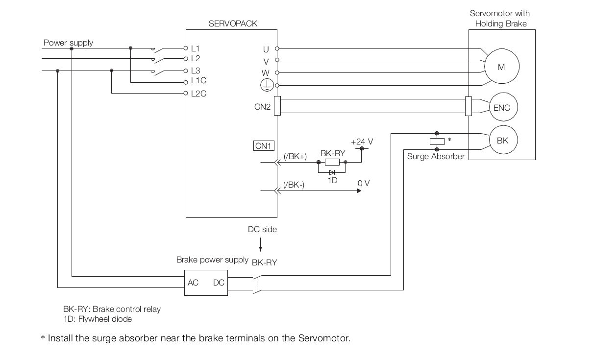
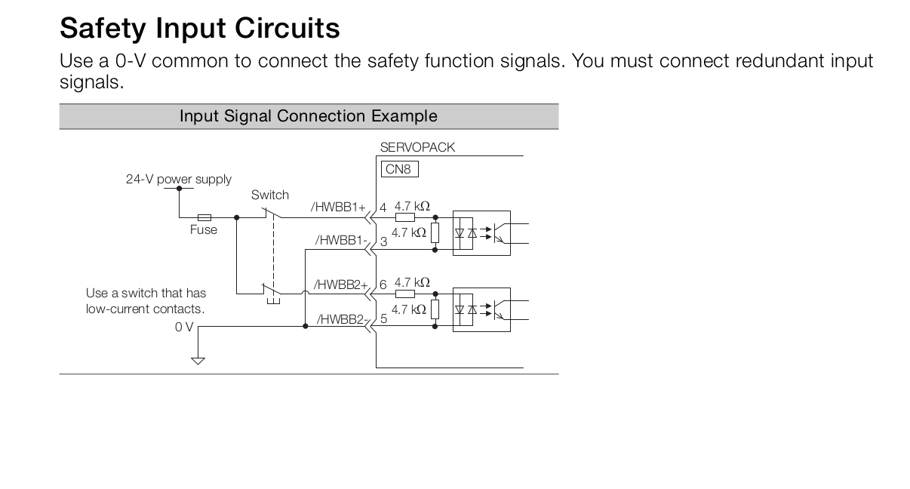

## smaller motor finding
- $323.51 Nm$ for holding
  - safety factor * 2
  - lifting = 1.8
- $1164.6 Nm$ for lifting

### BLDC gear motor
- **Motor** : https://www.uumotor.com/400n-m-in-wheel-high-torque-low-speed-geared-hub-motor.html
- **ESC** : 

### BLDC frameless motor
https://www.nanotec.com/eu/en/products/13525-dka115l048006

## need to be smaller, it is too big (the motor)

- [reference manual](./robotic_arm/sigma7_communication_references_project.pdf)
- 
- 
- 
- 
- 4.3: wiring the power supply to the SERVOPACK
  - **required external regenerative resistor between B1/+ and B2**
  - power supply: 200VAC to 240 VAC 50Hz/ 60 Hz
  - 
  - use three phase for continuous, steady flow of energy
  - 
  - 
  - 

  - 4.3.5 wiring regenerative resistors
  - 4.3.6 wiring reactors for harmonic suppression
  - 4.4.3 wiring absolute encoder
  - 4.4.4 wiring holding brake
    - 
  - use Photocoupler Circuit for isolate signal from high frequency power
  - use line driver for projection 
  - safety input circuit 
    - 

- introduction to ROS (robotic operating systme)
  - [ROS](./robotic_arm/ROS.pdf)

- 200VAC S7G gear motors 500W-7.5kW
  - https://www.yaskawa.com/products/motion/sigma-7-servo-products/gear-motors/s7g-gear-motors

servo control
- servo pack
  - Model Code Subtype: SGD7S-xxxxxxx00
    - control by 5V/24V square-wave pulse, each pulse equal to 0.001 degrees of rotation, faster the pulse, faster the spin
  - Model Code Subtype: SGD7S-xxxxxxxA0
    - control via Ethernet 